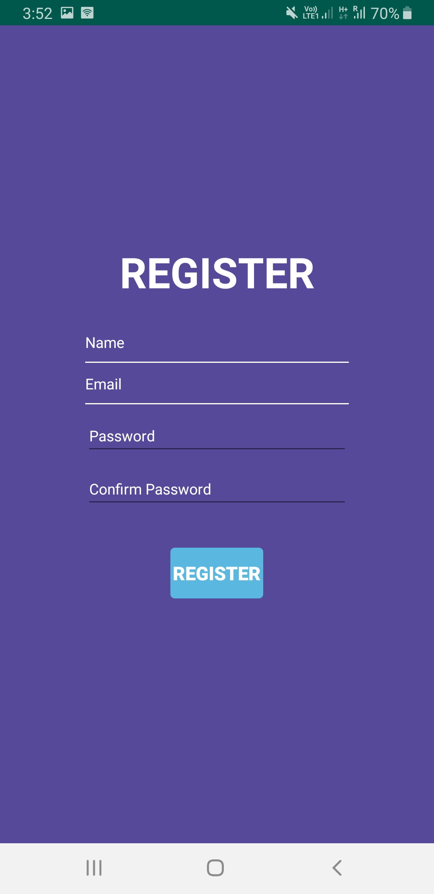
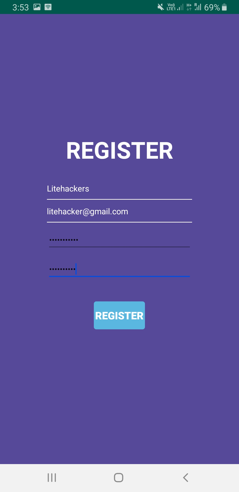
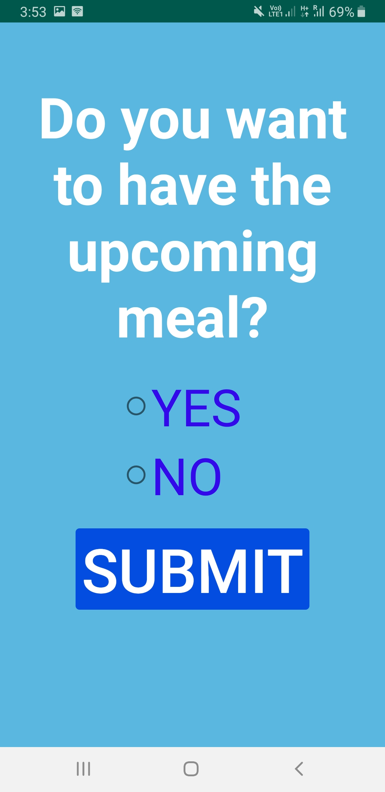
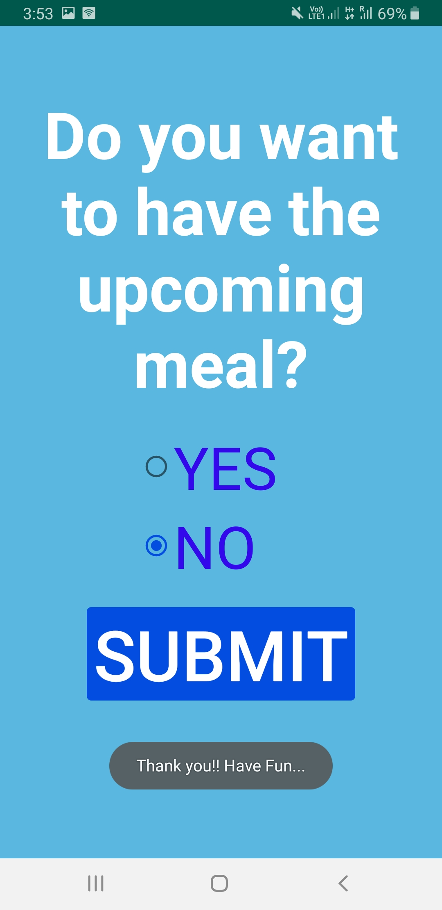
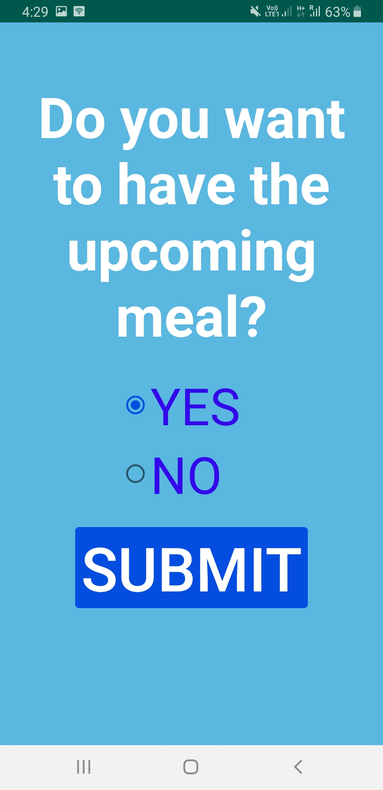
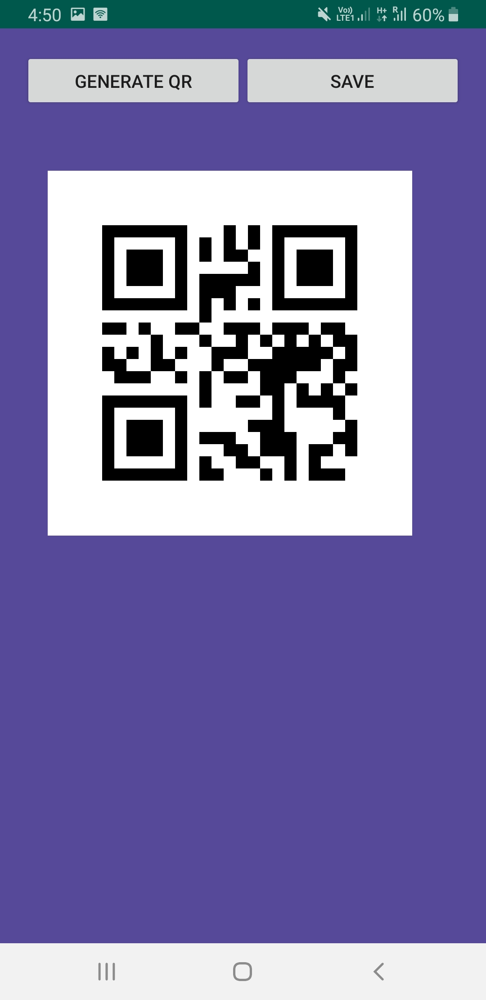
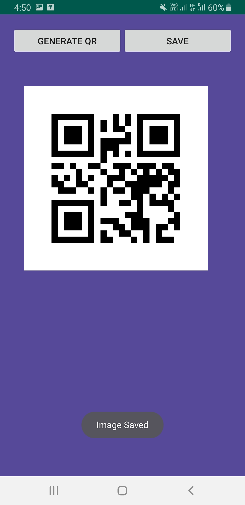
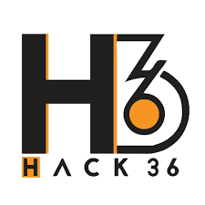

<h1>MOUT</h1>

### Mess on Your Tips

## Introduction
  Hack36-2k20 Project: An app based upon conserving resources leading to sustainable environment

## Problem

Tonnes of kgs of food is discarded at several college campuses every day. Most of them goes to landfills. Many students are neither conscious of the volume of waste they accumulate every day in their college mess. Failure to sustainably dispose of food waste significantly increases our environmental footprint so here we have come up with a solution to cope up with this problem and wastage of food.

## Proposal

Students marking themselves absent for the meals that they are not going to attend. For this, the requirement is a platform where students can register themselves by using their registration IDs. The app will consist of menu and would also provide details of the upcoming food material i.e. breakfast, lunch or dinner. They would be provided an option for choosing if they are interested in having the upcoming mess food or not. The response needs to be submitted 5 hours before of the mess cooking time. If they choose “YES”, then a QR code would be generated which needs to be scanned at the mess entrance for verification.

## Future Scope

In future we will be involving an healthy ecosystem which involves both conservation of food and also the increased quality of mess food so that students will also be involved in eating the mess food thus also conserving the food.

### Snapshots

    
    
    
    

 

    
    
    
    

### Made at:

